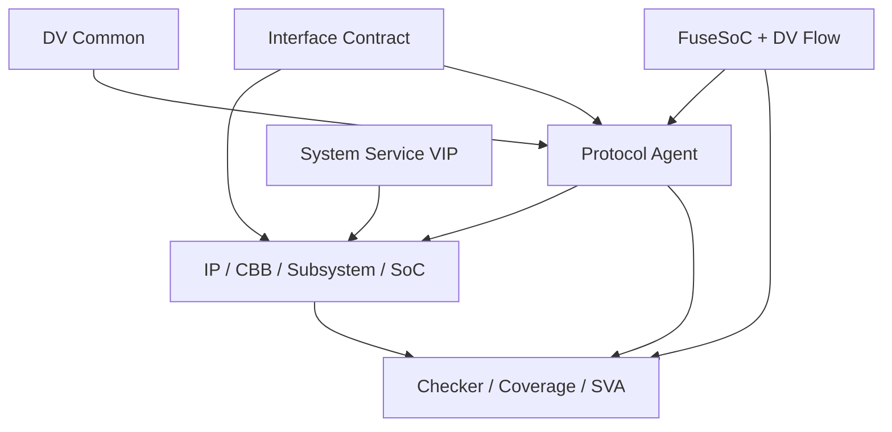

# 架构文档

本目录存放 VIP Repository 总体架构与设计决策文档。

## 目录

- [`roadmap.md`](roadmap.md) —— 实现路线图（阶段 0~6 与出口定义）
- 六层职责：Interface / Transaction / Agent / Service / Checking / Packaging

## 总体架构

## VIP 组件六层

1. **Interface Layer**：虚接口绑定、clocking block、modport 与信号采样；
2. **Transaction Layer**：协议事务、约束、pack/unpack、compare 与打印；
3. **Agent Layer**：sequencer、driver、monitor、master/slave responder；
4. **Service Layer**：memory model、RAL adapter、interrupt、clock/reset、fault injection；
5. **Checking Layer**：protocol checker、scoreboard adapter、SVA 与 coverage；
6. **Packaging Layer**：FuseSoC Core、metadata、测试、文档与 Release Manifest。

## 统一端口约定

每个 Monitor 至少提供：

- `transaction_ap`：完整事务；
- `error_ap`：协议错误与异常事件；
- （可选）`request_ap` / `response_ap`：分离建模时提供；
- （可选）`performance_ap`：延迟、带宽、stall 等性能事件。

## 关键设计决策（ADR）

| 决策 | 结论 |
|---|---|
| Monorepo vs 多仓 | 第一阶段采用单 Monorepo，成熟后拆分大型 VIP |
| 配置传递 | 一律通过 config object，禁止全局变量 |
| 结构差异表达 | 参数 / config / policy class / 独立 VLNV，不用宏 |
| 数据比较 | 字段级 compare policy，禁止只靠 `uvm_object::compare()` |
| 第三方代码 | 不复制进源码目录，通过 FuseSoC 依赖外部 Core |
