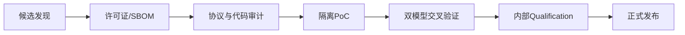

# 第三方资产准入流程

任何开源资产进入正式仓库前必须经过以下流程（依据 `plan.md` 第 9 节）：

## G0：来源与许可证

- 记录仓库 URL、commit hash、tag、作者、许可证与 NOTICE；
- 检查仓库级许可证与文件头是否一致；
- 检查依赖、submodule、生成代码与协议规范授权；
- 生成 SBOM；
- GPL/AGPL、未知许可证或仅限非商业使用的资产默认不进入正式库；
- Apache / Solderpad / MIT 等也必须经公司法务或开源办公室确认。

## G1：代码结构审计

- 是否为真正可复用 VIP，而非单一 DUT 的 Testbench；
- 是否支持 Master / Slave / Passive；
- 是否存在全局变量、硬编码层次路径、固定宽度与固定实例名；
- 是否依赖特定仿真器私有语法；
- 是否有可运行测试、coverage、checker 与文档；
- 是否存在未锁定外部依赖。

## G2：协议符合性审计

- 建立协议条款 — Requirement ID — Test ID — Coverage ID 映射；
- 审计正常、边界、异常与 reset 行为；
- 独立检查 driver 与 monitor，避免两者共享同一个错误假设；
- Protocol Checker 除检查数据结果外，还要检查信号时序与稳定性；
- 未覆盖功能必须在 compatibility metadata 中明确声明。

## G3：隔离 PoC

- 用最小 Master—Slave loopback 运行；
- 用至少两个独立 DUT 验证；
- 对接至少两个仿真器；
- 注入已知协议错误，确认 Checker 真实报错；
- 固定种子重跑，确认可复现。

## G4：交叉验证

建议至少使用两种独立实现交叉检查：

- 内部 UVM Master ↔ cocotbext 或 PULP 参考 Slave；
- TVIP Master ↔ 内部 Slave；
- 内部 Master ↔ PULP AXI 模块；
- 协议 SVA ↔ 故意带 Bug 的 mutation DUT；
- 商业 VIP ↔ 内部 VIP，条件允许时执行。

## G5：内部重构与发布

- 适配统一 interface contract；
- 适配统一 config、analysis port、error event 与 coverage API；
- 形成 FuseSoC Core；
- 补齐需求、架构、用户指南、测试计划与覆盖计划；
- 通过 Qualification 后再发布内部 VLNV；
- 不隐去第三方版权，不将内部重构声称为完全自研。
