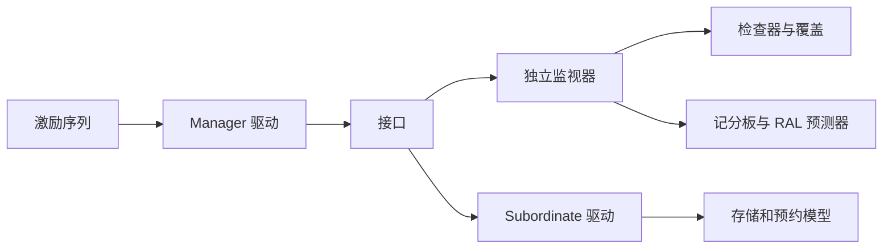

# AHB VIP 架构

## 1. 目的

**Profile**: FULL_UVM。将协议语义、独立观测、激励和设备模型分离。

## 2. 目标

每接口独立保存已接受地址与正在完成的数据阶段；四态载荷、有界历史，monitor 不依赖 driver 意图。

## 3. 结构

## 4. 组件

| 组件 | 类型 | 职责 |
| --- | --- | --- |
| ahb_if | interface | 物理连接 |
| ahb_monitor | uvm_monitor | 独立观测 |
| ahb_driver | uvm_driver | Manager 激励 |
| ahb_sequencer | uvm_sequencer | 序列调度 |
| ahb_agent | uvm_agent | 角色装配 |
| ahb_coverage | uvm_subscriber | 事件覆盖 |
| ahb_env | uvm_env | 环境集成 |
| ahb_checker | uvm_object | 周期规则 |
| ahb_memory | uvm_object | 稀疏存储、预约 |

## 5. 编译依赖

ahb_types_pkg → ahb_if → ahb_pkg → 独立断言/仲裁模块 → 测试顶层；class 文件只由 package include 一次。

## 6. 接口时序

AW/DW/剖面与可选宽度贯穿 virtual interface 类型。clocking 输入 #1step、输出 #0。HREADY 来自寄存的数据阶段目标，不可用当前地址选择响应。开发绑定与公共 HWIF 缺失信号明确分开。

## 7. 事务

每个 beat 分离请求与响应。monitor 根据总线创建地址记录，再用当前数据完成先前记录；发布深拷贝，订阅者遵守只读约定。

## 9. 配置

结构配置在 agent build 冻结；响应策略在地址接受时快照。结构变更在采样时诊断 AHB-CONFIG-FROZEN。

## 13. 驱动

流水调度分离已提供/已接受请求；克隆后 item_done；完成响应保留 sequence 身份。ERROR 首周期支持候选取消，reset 冲刷并返回中止响应。

## 14. 监视

复位中止 → ready 时完成旧数据 → selected/ready/HTRANS[1] 时接受新地址。低 HREADY 不重复接受；Passive 不驱动。

## 15. 检查器

只维护观测状态；区分 IDLE、固定 BUSY、INCR BUSY 和响应取消。负向测试限定预期规则/周期/数量。

## 16. 断言

局部地址对齐、两周期 ERROR 由独立断言检查；突发推进与阶段关联由有状态 monitor 检查。

## 18. 覆盖

normal/error/abort 分离；AHB_BIN 导出原始计数。现有导出未完整绑定配置身份和全合同覆盖模型，不能据此宣告 G4 通过。

## 20. 设备策略

接受时决定等待/响应；成功完成时提交存储。支持 RO/WO/read-clear/W1C/FIFO。后门避开采样边沿，同周期共享地址冲突尚无独立系统仲裁保证。

## 23. RAL 与桥接

adapter 拒绝不支持的稀疏使能；predictor 仅接收成功完成。bridge scoreboard 按路径比较映射后的字节流，USER 变换需显式策略；单一路径不证明原子性或全系统 exclusive 可见性。

## 29. 复位

外部复位清协议上下文；存储独立选择保留/清除/重装。停序列应排空已接受事务；仿真时间 watchdog 处理停钟。

## 32. 能力输入

profiles.yaml 固定 Lite32、AHB5_128、Classic32 见证配置；全参数验收仍由合同约束。

## 33. 构建

现有独立工具仍采用旧路径，执行前必须在本 VIP 的 build 内适配 Makefile/工具；最新版 suite 从冻结输入生成执行快照并传入 LOG_DIR。VCS 编译、运行 cwd 和临时文件全部在 build。

## 34. 依赖

标准 UVM、VCS、GNU make、宿主 uv 环境。无私有 DUT 层次或厂商 DPI 依赖。

## 35. 追溯

全部 169 条需求见 rtm.md；相关测试只提供局部证据，不能自动关闭复合需求。

## 36. 决策

独立 monitor；参数化 vif；HWIF 缺信号采用明确开发绑定；不静默退化剖面；不取百分比最大值合并覆盖。

## 37. 约束

S2/S3 差异必须独立审查。软件请求队列深度不是总线 outstanding。四 Manager/四目标例程未证明同址并发仲裁。

## 38. 评审

架构评审核查观测独立性、接口绑定和全剖面审查缺口；具体状态由本轮报告给出。

## 39. 完成定义

每项能力有实现归属、独立预期结果和可追溯测试，并完成适用规范审查。

验收范围和 AI 出口结论流程以 [验收说明](acceptance.md) 为准。历史工具输出已迁移至本 VIP/build，运行须指定 LOG_DIR 或 AHB_RUN_ROOT。
