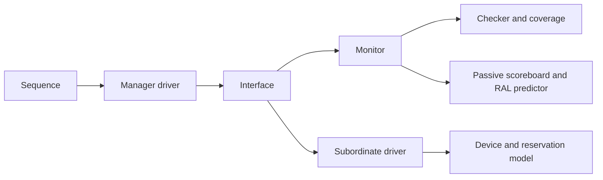

# AHB architecture
**Profile**: FULL_UVM
# 1. Purpose
Implement the full contract as separable protocol models and parameterized agents.
# 2. Architecture Goals
One accepted address context and one completing data context per interface, bounded history, four-state payloads, no dependency from observation to driver intent.
# 3. Architecture Overview

# 4. Component Matrix
| Component | Type | Roles |
| --- | --- | --- |
| ahb_if | interface | all |
| ahb_item | uvm_sequence_item | all |
| ahb_config | uvm_object | all |
| ahb_monitor | uvm_monitor | active/passive |
| ahb_checker | uvm_object | monitor/standalone |
| ahb_assertions | module | independent |
| ahb_driver | uvm_driver | manager |
| ahb_slave_driver | uvm_component | subordinate |
| ahb_sequencer | uvm_sequencer | manager |
| ahb_agent | uvm_agent | active/passive/disabled |
| ahb_coverage | uvm_subscriber | monitor |
| ahb_memory | uvm_object | responder/reference |
| ahb_scoreboard | uvm_subscriber | passive reference |
| ahb_env | uvm_env | integration |
# 5. Package Architecture
ahb_types_pkg precedes ahb_if; ahb_pkg includes class files in dependency order. Classes are include files, never compiled twice.
# 6. Interface Architecture
Structural parameters AW,DW,profile and optional widths propagate through all virtual interfaces and components. Base pins map by name to HWIF Lite, with explicit missing-signal limitations in requirement §23. Clocking inputs #1step sample pre-edge; outputs #0 drive after the sampled edge.
# 7. Transaction Architecture
Beat requests carry address/control and intended data. Monitor creates independent accepted records, then completes the prior record using current data/response. Burst aggregation uses actual observed sequence, never software queue depth. Each published object is independent.
# 8. Protocol Semantic Helper
Pure 64-bit address/wrap and byte-lane helpers. Golden expectations are handwritten independently. Reservation and sparse memory are separate state models with explicit invalidation.
# 9. Configuration Architecture
Protocol/issue and feature dependency validation precedes simulation. Runtime response policy snapshots are taken at address acceptance. No global mutable state.
# 13. Driver Architecture
Pipelined scheduler retains separate offered and accepted items; sequence item_done releases the request after cloning, responses preserve sequence IDs. Data completion and next address acceptance occur on the same edge. ERROR first cycle allows candidate cancellation. Reset flushes accepted and queued requests with abort responses.
# 14. Monitor Architecture
At every sampled edge: reset abort; complete prior data if ready; accept new address if selected and ready and HTRANS[1]. Low HREADY never reaccepts the candidate. Passive mode writes no signal.
# 15. Checker Architecture
Cycle checker owns only observed state. Wait exceptions distinguish IDLE, fixed BUSY, INCR BUSY and response cancellation. Rules report structured violations and have exact expected-error windows in tests.
# 16. Assertion Architecture
Independent interface checker for local address alignment and two-cycle ERROR. Stateful monitor checks burst progression and phase association.
# 18. Coverage Architecture
Monitor events feed separate normal/error/abort bins, throughput and latency counters. Bin identity includes configuration. No percentage-max merging.
# 20. Behavior Policy
Response callback chooses wait count and response at acceptance. Memory commits only successful data completions; device policy handles RO/WO/read-clear/W1C/FIFO. External backdoor synchronization is explicit.
# 23. RAL Integration
Adapter rejects unsupported sparse byte enables; predictor consumes completed observations, excluding ERROR/abort/exclusive failure.
# 29. Reset Architecture
External reset only. Protocol contexts clear; memory policy independently keeps, clears or reloads data. Sequence stop drains already accepted beats. Simulation-time watchdog catches stopped clocks separately from cycle wait counting.
# 32. Machine-readable Capability
config YAML records explicit enablement, supported/tested state and configuration fingerprint.
# 33. Build / Integration Architecture
VCS UVM1.2 compile/unit/independent vectors/smoke/regression. Per-run logs and positive completion oracles, subprocess timeout and nonzero exit checks.
# 34. Dependency Architecture
UVM standard library only. No private DUT hierarchy or vendor DPI. HWIF integration gap explicitly documented.
# 35. Requirement-to-Architecture Mapping
Master RTM maps all AHB requirement families to implementation components and validation responsibility.
# 36. Key Architecture Decisions
ADR1 independent monitor. ADR2 parameterized vif types for mixed instances. ADR3 development binding for missing HWIF signals. ADR4 develop directly in repos/aixsilicon_vip_repo/vip/amba/ahb; lifecycle metadata controls qualification, not physical location. ADR5 no silent classic/AHB5 fallback. ADR6 no percentage-based coverage union.
# 37. Architecture Constraints
S2/S3 differences cannot be asserted verified from S1. Software pending requests are not bus outstanding. Full architecture review remains NOT_RUN until all target profiles have reviewed source rules.
# 38. Architecture Review Checklist
Issue C pipeline and sample/drive contract defined; components frozen for implementation. Full-contract G1 remains NOT_RUN with G0.
# 39. Definition of Architecture Complete
All capabilities must have an implemented owner, independent oracle and traceable test before qualification.

## Bridge observation extension
`ahb_bridge_scoreboard` receives upstream/downstream monitor completions and normalizes them into byte events. A per-path `ahb_translation_policy` supplies address mapping, source/target widths and endian modes, error fanout and attribute transforms. Ordering is FIFO per path; use separate instances for independently ordered routes. Optional USER comparison requires an explicit mapping override. `check_phase` detects unmatched bytes; queue limits are environment policy. This component does not infer system atomicity or exclusive visibility from a single observation path.

# Implementation refinements
Bus signals are resolved nets, permitting a DUT connection and inactive clocking output without illegal variable-driver combinations. Monitor publishes deep copies for cycle/beat/violation events, protecting internal state from subscribers. Configuration structural shape is frozen during agent build and checked at each sampling edge; dynamic response policy values remain adjustable. Classic arbiter owns HMASTER/HMASTLOCK; Manager observes grant and preserves attempt identity over RETRY/SPLIT. The system example uses four independent data-phase target selectors and four shared byte memories; same-address concurrent arbitration remains outside this example.
