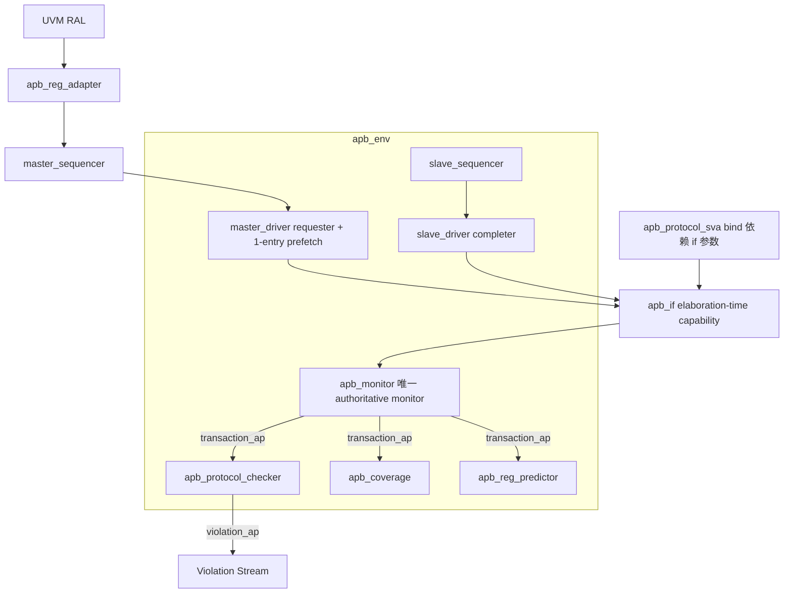

# AIXSILICON APB VIP — Architecture Specification（回答 How）

> **Document ID**: `aixsilicon:vip:apb:arch` · 版本: 1.0.0-arch-r4
> **VIP Name**: `apb` · **Profile**: `FULL_UVM`
> **上游输入**: `docs/requirement.md` 1.0.0-g0-baseline-r3.1（G0 PASS）
> **HWIF Contract**: `aixsilicon:hwif:apb`（`IFC-APB-001`）
> **Target VLNV**: `aixsilicon:vip:apb:1.0.0`
> **Status**: `G1 PASS / Architecture Freeze`（r4 闭合 4 blocker：参数分层、
> SVA elaboration 载体、真单一 monitor、back-to-back prefetch；P1/P2 修正见 §24）
>
> 术语：文档层 Requester/Completer；UVM 类名 apb_master_*/apb_slave_*
> （master ≡ requester、slave ≡ completer）。

---

# 1. Purpose

定义 APB VIP 的组件结构、职责边界、运行时模型与工程约束（How）。
不做 APB interconnect；单 requester/completer 端点协议模型。

# 2. Architecture Goals

1. 协议正确（IHI 0024E，含 Signal Validity 语义）；2. 轻量；3. 单一协议语义模型；
4. Public API 稳定（sequence + RAL 两个入口）；5. Monitor/Checker 优先；
6. 可扩展；7. anti-overcheck；8. **两相分离原则**（ADR-0，见 §2.1）。

## 2.1 核心架构原则（ADR-0，一句话冻结）

> **APB VIP 将 "physical interface capability" 与 "runtime verification policy"
> 严格分离：前者由 interface parameters 在 elaboration-time 决定（信号存在性/宽度/
> generate-if），后者由 `apb_config` 在 runtime 决定（行为策略/检查开关/severity）；
> 所有 SVA generate、optional signal 宽度/存在性均只依赖前者。**

# 3. Architecture Overview



三大核心模型：

```text
Stimulus      sequence → master_driver（prefetch）→ apb_if
Observation   apb_if → 唯一 monitor → normalized transaction
Qualification transaction → checker(UVM) + X-check + SVA + coverage + predictor
```

# 4. Components（组件矩阵，FULL_UVM）

| 组件 | FULL_UVM | 说明 |
|---|---|---|
| apb_if | ✅ | elaboration-time capability 参数（§6） |
| apb_config | ✅ | runtime policy（§9） |
| apb_item | ✅ | normalized transaction（§7） |
| apb_monitor | ✅ | **env 级唯一实例**（§14） |
| apb_master_driver | ✅ | Requester + prefetch（§12） |
| apb_slave_driver | ✅ | Completer 四层 responder（§12） |
| apb_master_sequencer / apb_slave_sequencer | ✅ | |
| apb_master_agent / apb_slave_agent | ✅ | **不含 monitor**（§10） |
| apb_protocol_checker | ✅ | transaction 语义层 + X-check |
| apb_protocol_sva | ✅ | bind module，generate 依赖 if 参数 |
| apb_coverage | ✅ | subscriber |
| apb_reg_adapter / apb_reg_predictor | ✅ | P0/P1 |
| apb_env | ✅ | 组装：agents + monitor + checker + cov |

agent_mode 裁剪（同一套代码）：ACTIVE_MASTER / ACTIVE_SLAVE / PASSIVE / DISABLED；
PASSIVE 用户直接实例化 apb_env（无 driver）或单独用 apb_monitor。

# 5. Package Architecture

```text
apb_types_pkg.sv   独立类型包（无 UVM；check_type/位宽/parity-grouping helper）
apb_pkg.sv         UVM 包
apb_if.sv          interface（elaboration-time capability）
apb_protocol_sva.sv checker module（bind）
```

include 顺序：config → violation → item → monitor → sequencer → driver →
agent → sequences → checker → coverage → ral → env。

# 6. Interface Architecture（blocker① 落地：两层能力）

## 6.1 elaboration-time：interface parameters（物理能力）

```systemverilog
interface apb_if #(
  parameter int ADDR_WIDTH       = 32,
  parameter int DATA_WIDTH       = 32,     // ∈ {8,16,32}（CFG-003）
  parameter bit HAS_PSTRB        = 1,      // APB4+
  parameter bit HAS_PPROT        = 1,      // APB4+
  parameter int USER_REQ_WIDTH   = 0,      // 0=PAUSER 不存在
  parameter int USER_DATA_WIDTH  = 0,      // 0=PWUSER/PRUSER 不存在
  parameter int USER_RESP_WIDTH  = 0,      // 0=PBUSER 不存在
  parameter bit HAS_PWAKEUP      = 0,      // Wakeup_Signal property
  parameter bit HAS_PNSE         = 0,      // RME_Support
  parameter bit HAS_CHECK        = 0       // Check_Type ≠ False（*CHK 族）
) (
  input var logic pclk,
  input var logic presetn,
  input var logic check_enable               // APB5 Check Enable（外部输入）
);
  localparam int PADDRCHK_WIDTH = (ADDR_WIDTH+7)/8;   // CT-4 parity grouping
  localparam int PSTRBCHK_WIDTH = (DATA_WIDTH/8+7)/8;
```

* **物理存在性由 HAS_*/WIDTH 参数决定**：参数为 0 的信号在接口内为
  `logic` 零宽向量省略（generate 声明），物理上不存在；
* PREADY/PSLVERR 恒存在（VIP 端口完整，OO-1）；
* clocking block 只含实际存在的信号（generate-if 组装）；
* NUM_SLAVES 参数化 psel（driver 仅用 psel[0]）；
* 组合 helper：`apb_setup_phase()/apb_access_phase()/apb_transfer_done()`。

## 6.2 runtime：apb_config（行为策略）

只承载行为：protocol_version / enable_checker / enable_coverage / timeout /
severity / recommendation / x_check / completer 行为 / safety 门。

## 6.3 一致性校验（关键纽带）

`apb_env.build_phase` 调用 `validate_interface_vs_config()`：

```text
cfg.protocol_version >= APB4 但 vif.HAS_PSTRB=0      → FATAL mismatch
cfg.enable_wakeup=1 但 vif.HAS_PWAKEUP=0             → FATAL
cfg.rme_support=1 但 vif.HAS_PNSE=0                  → FATAL
cfg.check_type!=NONE 但 vif.HAS_CHECK=0              → FATAL
cfg.user_req_width>0 但 vif.USER_REQ_WIDTH=0         → FATAL
（反向不 FATAL：物理信号存在而 runtime 关闭 = 合法的"不用"）
```

**OO tie-off 归一化**（ADR-8 修订）：DUT 缺 PREADY/PSLVERR 输出在
**integration 层 tie-off 解决**（`vip.pready = 1'b1` / `pslverr = 1'b0`），
VIP 语义模型视为正常 APB 信号；`dut_pready_tied_high`/`dut_pslverr_tied_low`
仅作 metadata/debug 信息，**不关闭任何 checker**（防"配了 tied_high 连该查的
一起跳过"）。

# 7. Transaction Architecture（能力归一化）

`apb_item` 为 normalized transaction——物理信号（elaboration-time）→ 统一事务
（runtime）：

| 层 | 字段 | 归一化 |
|---|---|---|
| Request | rand direction/addr/wdata/strb/prot/nse/auser/wuser/wakeup + start_delay | 物理不存在的信号字段恒默认值且 driver/monitor 不触碰 |
| Response | rdata/slverr/buser/ruser | **request item 经 driver 填充响应字段后返回**（response ownership：request item 自携带响应，§19 RAL-2） |
| Timing | `requested_wait_cycles`（Completer 激励）/ `observed_wait_cycles`（monitor 重建） | TRN-002 分离 |
| Status | status（OK/ERROR/ABORTED）+ start_time/end_time | |
| Derived | aligned / strb_class / pas_space | helper |
| Injection | inject_*（仅 allow_protocol_violation 生效） | |

# 8. Protocol Semantic Helper（types_pkg，单一语义源）

```text
apb_wait_bucket / apb_is_aligned / apb_strb_class
apb_data_width_legal / apb_addr_width_legal
apb_pas_space(nse, prot[1])              CP-07
apb_phase_pattern(...)                   CP-08
apb_parity_group(addr, i, addr_width)    末 group 仅覆盖实际存在的剩余地址位
                                         （实现可等价将不存在位视为 0——实现技巧
                                         非协议语义）
apb_parity_check_bit(...)                奇校验（每 check bit 覆盖 ≤8 bit）
```

# 9. Configuration Architecture（runtime policy）

`apb_config` 分组：Protocol 版本 / Verification（checker/cov/recommendation/
x_check）/ Timeout（cycles + **timeout_severity** 默认 UVM_ERROR）/ Safety 门 /
Completer 行为 / 随机基线。无 setup_to_access_gap（CFG-007）。

`apply_version_defaults()`：CFG-001/002/003..005/006/008/009 派生校验；
`validate_interface_vs_config()` 见 §6.3。

# 10. Agent Architecture（blocker③ 落地：真单一 monitor）

```text
apb_env
├── apb_master_agent（sequencer + driver；无 monitor）
├── apb_slave_agent（sequencer + driver；无 monitor）
├── apb_monitor（env 级唯一 authoritative observation stream）
├── apb_protocol_checker（订阅 monitor.transaction_ap）
├── apb_coverage（订阅 transaction_ap）
└── apb_reg_predictor（P1，订阅 transaction_ap）
```

* **一条 APB interface = 一个 monitor 实例**——不实例化第二个再 mute；
* agent 单独复用（无 env）且需要观察时，`apb_master_agent` 提供
  `use_local_monitor=0`（默认）可选项——默认路径始终 env monitor；
* PASSIVE：直接实例化 env（driver 不创建）或独立 apb_monitor。

# 11. Sequencer / Sequence

`uvm_sequencer#(apb_item)` ×2；Primitive：write/read/random/incrementing/error；
`apb_base_sequence`：`do_write/do_read` helper。

# 12. Driver Architecture

## 12.1 master_driver（blocker④ 落地：prefetch）

**Master driver 内含 one-entry next-item prefetch/lookahead，保证
zero-IDLE back-to-back（PRO-008）。**

```text
IDLE ─ get_next_item(cur) ─► SETUP(cur) ─► ACCESS(cur)
ACCESS: pready=0 → 保持（wait）
ACCESS: pready=1（completion 拍）
          │  completion 之前（进入 ACCESS 即）：
          │    seq_item_port.try_next_item(nxt)
          ├─ nxt 有效 → 完成拍直接 SETUP(nxt)（PSEL 保持）
          └─ 无       → item_done(cur) → IDLE
```

* `current_req` 完成拍 `item_done`；`next_req` 已预取时次拍直入 SETUP；
* 无下一笔：完成拍 item_done → IDLE（PSEL 撤销）；
* SETUP 恰 1 拍（RUL-001）；无 gap 配置（CFG-007）；
* *CHK 输出为 BFM 协议驱动能力（LIM-001 r3.1 表述）；
* **reset during active request**（P1 修正，与 prefetch 联合设计）：
  1. 终止总线驱动（信号回安全值）；
  2. current item.status=APB_ABORTED；
  3. **完成 sequencer 握手（item_done 返回 aborted item）**——sequence 不挂死；
  4. 清空 prefetch 的 next_req（其 status 亦标 ABORTED 返还）；
  5. FSM 回 IDLE。

## 12.2 slave_driver（Completer 四层 responder）

```text
① sequence responder : SEQUENCE_CONTROLLED（item 直通）
② memory responder   : generic memory-backed（REQ §9）
③ error responder    : NEVER/RANDOM/ADDRESS_RANGE
④ wait policy        : ZERO_WAIT/FIXED_WAIT/RANDOM_WAIT
```

* SETUP 拍采样请求 → respond() 决策 → ACCESS 期按 wait 计数释放 pready；
* ZERO_WAIT 即 PREADY 常高（RUL-010 合法实现）；
* *CHK 响应侧校验位按 check_type 生成。

# 13. Monitor Architecture（唯一观察流）

* env 级唯一实例，完全被动；
* 相位重建：IDLE→SETUP→ACCESS 累计 observed_wait_cycles→completion
  （=psel&&penable&&pready，RUL-010）→完整 item→**transaction_ap**；
* **两流语义（P2 修正落地）**：事务结果（含 ABORTED/SLVERR）走 transaction_ap
  （status 字段一体表达）；协议违规走 checker.violation_ap。**无 error_ap**；
* SETUP 拍 PREADY=1 不终止等待；
* monitor 不碰 memory（ADR-5）。

# 14. Checker Architecture（config/severity 传递）

* CHK-R7：读事务 strb==0（RUL-006/007）；
* CHK-R9：ACCESS 超时 → violation，severity=`cfg.timeout_severity`（TIM-001）；
* CHK-R10：SETUP 拍不判 completion（RUL-010）；
* CHK-R11：Signal Validity 采样窗（RUL-011）；
* CHK-X：X/Z checking（`enable_x_check` 默认开，VER-013）——有效窗口内 X/Z → ERROR；
* CHK-REC：PSLVERR recommendation（INFO/WARN，RUL-005）；
* 输出 `apb_violation` → `violation_ap`；
* build_phase config_db 取 config（单一实例）。

# 15. Assertion Architecture（blocker② 落地：generate 只依赖 if 参数）

`apb_protocol_sva`（checker module，bind 到 apb_if）：

**generate-if 只依赖 interface parameter（elaboration 常量）**：

```systemverilog
generate if (HAS_PSTRB) begin : g_strb_rules
  // F1: !pwrite |-> pstrb==0
  // B1 写路径 $stable(pstrb)
end
if (HAS_CHECK) begin : g_check_rules ... end
endgenerate
```

| SVA | 属性 | 载体 |
|---|---|---|
| A1 | SETUP 恰 1 拍且次拍 PSEL 保持+PENABLE=1（RUL-001） | 恒编译 |
| A2 | PENABLE 仅 ACCESS（RUL-002） | 恒编译 |
| B1 | ACCESS 延长期有效 request 字段 $stable | **generate-if HAS_*** |
| C1 | completion 次拍 PENABLE 撤销或直入下一 SETUP（RUL-004） | 恒编译 |
| C2 | completion 载体 `psel&&penable&&pready`；SETUP 拍 PREADY=1 不触发（RUL-010/UT17） | 恒编译 |
| E1 | PSLVERR 语义窗由 monitor 保证；**不写 pslverr==0 强断言**（RUL-005/UT18） | 恒编译 |
| F1 | `!pwrite |-> pstrb==0`（RUL-006） | generate-if HAS_PSTRB |
| G1 | `!presetn |=> !psel`（RUL-008） | 恒编译 |
| H1 | `penable && !psel` 禁止（RUL-011 辅助） | 恒编译 |

runtime 只控制（经 interface 内 `logic sva_enable` 等信号，由 bind 参数/连线传入）：
assertion enable/disable、severity 选择。**UVM config 永不进入 generate**（ADR-0）。

分工：cycle 层 SVA（native $error）；config 感知策略（REC/X/timeout-severity）
在 UVM checker（ADR-4）。

# 16. Coverage Architecture

`apb_coverage`（uvm_subscriber#(apb_item)）订阅 transaction_ap；
**基于 normalized transaction 而非物理 pin**；covergroup 按 config 裁剪
（enable_prot→CP-05、enable_strb→CP-06/CR-04、rme_support→CP-07、pattern→CP-08）。

# 17. Completer Model（generic responder）

memory-backed：写按 strb 字节合并（APB3 全 lanes）；读返回 memory[addr]；
未命中 0 + 可配 PSLVERR。**非外设语义 reference model**（REQ §9/LIM-005）；
真实外设行为由用户 policy/scoreboard 承载。read-data override 经 callback
`apb_slave_callback_base::post_response()`（ERR-003）。

# 18. Error Injection

ERR-001..004 Completer config/item；ERR-005/006 Requester inject_* + 门。
不建独立 injector（ADR-6）。

# 19. RAL Integration（response ownership 冻结）

```text
UVM RAL → apb_reg_adapter → master_sequencer → master_driver → apb_if → DUT
DUT → apb_if → apb_monitor → transaction_ap → apb_reg_predictor → mirror（P1）
```

* **Response ownership（P1 修正冻结）**：master_driver 在 completion 时
  **将响应字段填回 request item 本身**（rdata/slverr/status 已是 item 字段）
  后 `item_done(req)`——**不 put_response 独立 rsp 对象**；
* adapter 相应配置：`provides_responses=0`（req 自携带响应）；
  `supports_byte_enable=(protocol_version>=APB4) && HAS_PSTRB`（RAL-003，
  以 interface 参数为准）；
* reg2bus→apb_item；bus2reg 从同一 item 回填。

# 20. Reset / Timeout Architecture

* Reset：driver（§12.1 五步）、monitor（复位拍 ABORTED 发布）、
  checker（ABORTED=WARN）、SVA G1；
* Timeout：monitor ACCESS 挂起计数 → violation，severity=`cfg.timeout_severity`
  （0=禁用）；self_test 超时窗用 `suppress_pready`；
* clocking skew（P1 修正）：**架构只冻结"race-free 要求"**——requester/completer
  drive 于 DUT 采样沿前稳定、monitor 于采样沿后观察一致值；具体 skew
  （#1step/#0/#1）属 implementation，由 self_test 证明无 race（UT03/UT05）。

# 21. Public API Architecture

**Public 入口仅两个：sequence（自建/继承 primitive）+ UVM RAL。**
Convenience 层（如 static helper / sample code）放 user-guide（P2），
**env 不提供 master_write/read blocking API**（避免三入口/仲裁混乱——P2 修正）。

# 22. Build / Dependency

* 编译：`self_test/Makefile`（vcs，xrun 预留）+ filelist.f；
* 依赖：UVM 1.2 仅；
* FuseSoC：`aixsilicon_vip_apb_1.0.0.core`（rtl/selftest）。

# 23. Requirement-to-Architecture Mapping

| REQ/RUL | 组件 |
|---|---|
| PRO-002/003/008 | master_driver 相位 + prefetch（§12.1） |
| PRO-004/005 | driver + item.direction |
| PRO-006 | slave_driver wait policy |
| PRO-007 | slave_driver error responder |
| PRO-009/010 | item.strb/prot + HAS_PSTRB/PPROT + RAL |
| PRO-011 | item user ×3 + USER_*_WIDTH 参数 |
| PRO-012 | item.wakeup + wakeup policy（HAS_PWAKEUP） |
| PRO-013 | item.nse + HAS_PNSE + CP-07 |
| PRO-014 | HAS_CHECK + check_type + PADDRCHK_WIDTH |
| PRO-015/016 | reset（§20） |
| RUL-001..008/010/011 | SVA（§15）+ CHK（§14） |
| RUL-005 REC | CHK-REC |
| RUL-009/§14 | CHK-R9 + timeout_severity |
| VER-013 | CHK-X |
| OO-1/2 | §6.3 tie-off 归一化（不关 checker） |
| VER-009 | coverage CP/CR |
| RAL-001..004 | adapter/predictor（§19） |
| §8 两流 | transaction_ap / violation_ap（§13） |

# 24. Key Architecture Decisions（ADR）& Constraints

| ADR | 决策 |
|---|---|
| **ADR-0** | **physical capability（interface 参数，elaboration-time）与 runtime policy（apb_config）严格分离；SVA generate 只依赖前者** |
| ADR-1 | env 级唯一 monitor（一条总线一个 authoritative observation stream） |
| ADR-2 | 最大超集 interface 的信号存在性由 HAS_*/WIDTH 参数决定（非"存在但恒 0"）；runtime"不用"≠物理不存在 |
| ADR-3 | Completer 决策集中 respond()（四层 responder） |
| ADR-4 | SVA native report；config 感知策略在 UVM checker |
| ADR-5 | monitor 不碰 memory |
| ADR-6 | 注入内嵌 driver 策略层 |
| ADR-7 | types_pkg 无 UVM 依赖 |
| ADR-8 | DUT optional 输出经 integration 层 tie-off 归一化进入语义模型；tied 配置仅 metadata，不关 checker |
| ADR-9 | one-entry prefetch 保证 back-to-back；reset 时 prefetch 联动清空 |
| ADR-10 | timeout severity 可配（policy/How） |
| ADR-11 | PWAKEUP 独立 policy（wakeup_mode: FOLLOW_TRANSFER 默认 / MANUAL / SEQUENCE_CONTROLLED），不绑死 transfer phase（always-valid 信号） |
| ADR-12 | Response ownership：req item 自携带响应，item_done(req)，provides_responses=0 |
| ADR-13 | Public API 仅 sequence + RAL 两入口 |

| C# | 约束 |
|---|---|
| C-1 | 禁全局变量，config 唯一传入 |
| C-2 | monitor_cb 无 output |
| C-3 | 默认约束合法协议；负向需 config 门 |
| C-4 | Public/Internal 分离 |
| C-5 | 命名 `apb_*`、VLNV `aixsilicon:vip:apb:1.0.0` |
| C-6 | 协议语义计算走 §8 helper |
| C-7 | SETUP 恰 1 拍是协议事实（CFG-007） |
| C-8 | `validate_interface_vs_config()` 强制物理能力与 runtime policy 一致（§6.3） |
| C-9 | clocking skew 不在架构冻结具体值，race-free 由 self_test 证明 |

# 25. Definition of Architecture Complete（9 问）

1. 组件清单？→ §4；2. 事务模型？→ §7；3. 激励链？→ §3/§12.1（prefetch）；
4. 观察链？→ §13（唯一 monitor）；5. 检查链？→ §14/§15/§17（violation 模型）；
6. 配置？→ §6.2/§6.3/§9（两层）；7. 复位/超时？→ §20；8. RAL？→ §19（ownership 冻结）；
9. 风险？→ completer 拍位/race——UT03/UT05/UT17/UT18 覆盖，skew 由 self_test 证明。

**G1 状态：PASS（Architecture Freeze 1.0.0-arch-r4）→ 进入 G2 实现**
