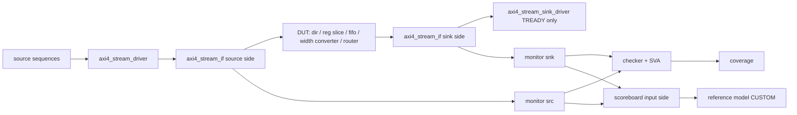

# axi4_stream VIP Architecture Specification（架构与设计规格）

> 本文件是源码设计文档。涉及运行状态、回归/覆盖数值、证据或 Gate 的内容不在此填写，
> 实际结果写入本 VIP 的 `reports/<run-id>` 报告 metadata。
> 机器 required/priority/bin 集合只维护在 `config/verification-plan.yaml`。

> **Document ID**: `aixsilicon:vip:axi4_stream:arch`
> **VIP Name**: `axi4_stream`
> **Protocol / Interface**: `AMBA AXI4-Stream（ARM IHI 0051A）`
> **Version**: `0.1.0`
> **Status**: `Draft`
> **Owner**: `amba-vip`
> **Requirement Baseline**: `docs/requirement.md`（contract `../axi_stream_vip_contract.md` v0.1.0）
> **Profile**: `FULL_UVM`
> **Target VLNV**: `aixsilicon:vip:axi4_stream:1.0.0`

---

# 1. Purpose

本文把 `docs/requirement.md` 的 90 条 REQ 转化为可实现、可验证的 UVM/SystemVerilog
架构：组件划分与职责、事务模型、采样与驱动时序、复位与 epoch、事件与参考模型策略、
打包与构建方式。本文不定义测试清单（见 `docs/validation-plan.md`）、不记录执行结果。

---

# 2. Architecture Goals

1. **Protocol Correctness**：所有检查以 `docs/requirement.md` §3 的 15 条 ruleID 为准。
2. **单一语义模型**：lane/byte/token 归一化只有 `axi4_stream_types_pkg` 一处实现，
   driver/monitor/checker/coverage/scoreboard 全部调用，禁止各自复刻（REQ-INT-002、
   REQ-PRO-005）。
3. **观测独立于激励**：monitor 仅依赖 interface 采样，不使用 driver item
   （REQ-MON-001）；driver 不依赖 monitor 完成信息推进（REQ-SRC-005）。
4. **显式合同、无隐式推断**：端口存在性、组包模式、比较模式、USER 映射、
   顺序与 CDC 复位合同都必须显式配置（REQ-CFG-003、REQ-SCB-003/004/005、REQ-RST-005）。
5. **可诊断**：四态保留、epoch 标注、结构化 error event、逐字段稳定性子码。
6. **可自验证**：独立 fixture（不 import VIP pkg）+ golden vector + 源码变异。

---

# 3. Architecture Overview



三大核心模型映射：

| 模型 | 回答 | 主要组件 |
|---|---|---|
| Stimulus Model | 如何制造协议行为 | sequences → driver → interface（+ sink driver 提供 ready） |
| Observation Model | 如何理解协议行为 | interface → monitor → observed beat/packet |
| Qualification Model | 如何证明行为正确 | checker/SVA/coverage/scoreboard/reference model |

---

# 4. Component Matrix

| Component | Type | Role | Description |
|---|---|---|---|
| `axi4_stream_if` | interface | all | 参数化信号、clocking、modport、存在性 adapter |
| `axi4_stream_types_pkg` | package | all | 纯语义：byte 分类、缺省归一化、token 化、包 API、配置校验、比较原语 |
| `axi4_stream_beat_item` | uvm_sequence_item | source | 待发送 beat（四态 payload + 注入计划 + 完成状态） |
| `axi4_stream_packet_item` | uvm_sequence_item | source | 包级请求（from_bytes/from_beats/增量） |
| `axi4_stream_ready_item` | uvm_sequence_item | sink | 背压策略（9 种模式） |
| `axi4_stream_observed_beat` | uvm_object | monitor | 采样事实（原始值 + 归一化 + epoch/周期/等待） |
| `axi4_stream_observed_packet` | uvm_object | monitor | 组包结果（含 synthetic/abort 标注） |
| `axi4_stream_error_event` | uvm_object | checker/monitor | 结构化违规与内部告警 |
| `axi4_stream_config` | uvm_object | all | 结构镜像 + 行为 + 时序 + 验证配置 + epoch |
| `axi4_stream_stream_model` | uvm_object | all | 语义模型门面（转发 types_pkg） |
| `axi4_stream_driver` | uvm_driver | active source | 握手、零气泡流水、专用非法注入路径 |
| `axi4_stream_sink_driver` | uvm_component | active sink | 只驱动 TREADY 的背压策略 |
| `axi4_stream_sequencer` | uvm_sequencer | active source | beat 级 sequence 调度 |
| `axi4_stream_monitor` | uvm_component | all | 独立采样、组包、事件发布、统计 |
| `axi4_stream_checker` | uvm_component | all | 15 条规则、五类区分、可开关/严重度/限报 |
| `axi4_stream_assertions` | module | independent | 可 bind/可例化的 SVA |
| `axi4_stream_coverage` | uvm_subscriber | all | 10 个 covergroup + 重点交叉 |
| `axi4_stream_reference_model` | uvm_object | active/passive | CUSTOM 比较扩展点、路由重写合同 |
| `axi4_stream_scoreboard` | uvm_scoreboard | active/passive | EXACT_BEAT/LOGICAL_STREAM/CUSTOM 比较 |
| `axi4_stream_violation_injector` | uvm_component | negative | 注入计划与期望匹配核查 |
| `axi4_stream_agent` | uvm_agent | active/passive | 角色组合与 vif/cfg 校验 |
| `axi4_stream_env` | uvm_env | integration | 多接口连接、复位合同、统计汇总 |

Profile 裁剪（REQ-SCP-005）：`FULL_UVM` 使用全部组件；`PASSIVE_UVM` 只创建
monitor（+ checker/coverage/scoreboard）；`CHECKER_ONLY` 使用
`axi4_stream_assertions` 与纯 SV checker 构建路径，不依赖 UVM package、不启动驱动线程。

---

# 5. Package Architecture

```text
src/
├── axi4_stream_types_pkg.sv          纯语义（无 UVM 依赖）
├── axi4_stream_if.sv                 参数化接口
├── axi4_stream_pkg.sv                唯一对外 package（import uvm_pkg + types_pkg）
├── axi4_stream_config.sv             配置与校验
├── model/axi4_stream_stream_model.sv 语义模型门面
├── transaction/axi4_stream_item.sv   事务与控制模型
├── agent/                            monitor / driver / sink_driver / sequencer / agent
├── checker/                          checker + assertions(module)
├── coverage/                         coverage
├── scoreboard/                       scoreboard + reference_model
├── sequences/                        base + 场景序列库
└── env/                              env + violation_injector
```

编译顺序：`axi4_stream_types_pkg` → `axi4_stream_if` → `axi4_stream_assertions` →
`axi4_stream_pkg`（内部按类依赖 include）。每个类只编译一次，include 使用
`ifndef` 保护。用户侧只需 `import axi4_stream_pkg::*`。

---

# 6. Interface Architecture

## 6.1 参数与存在性

`axi4_stream_if` 参数：`DATA_WIDTH`、`ID_WIDTH`、`DEST_WIDTH`、`USER_WIDTH`、
`HAS_TDATA/HAS_TREADY/HAS_TKEEP/HAS_TSTRB/HAS_TLAST`。缺省端口保留 **1 bit 物理占位**
（避免 `[-1:0]`），存在性由 `exists_*()` 查询，行为与检查按存在性裁剪（REQ-CFG-002/005）。

## 6.2 Clocking 与采样/驱动 skew（REQ-INT-001）

| clocking | 采样/驱动 | 用途 |
|---|---|---|
| `mon_cb` | `input #1step` | monitor/checker 采样边沿前已稳定的值 |
| `drv_cb` | `output #0`、`input #1step` | source driver 在采样边沿后驱动下一周期值 |
| `ready_cb` | `output #0`、`input #1step` | sink driver 只驱动 TREADY，观察 TVALID |

monitor 与 checker 均使用 `mon_cb`（同一时钟块、同一 `#1step`），对同一边沿的解释一致，
避免 blocking assignment race。driver 使用非阻塞赋值（`<=`），握手判定在
`@(drv_cb)` 之后进行，保证"只有在时钟上升沿、复位无效且 `TVALID && effective_TREADY`
才算一次成功传输"（REQ-PRO-001）。

## 6.3 HWIF 关系（SSOT）

本仓当前**没有** AXI4-Stream HWIF 契约。因此 `axi4_stream_if` 是明确命名的
**development binding**，仅用于本 VIP 的独立测试与自验证；不宣称与公共 HWIF 兼容，
也不删除需求（`docs/requirement.md` §23 第 3 条）。若后续仓库提供
`aixsilicon:hwif:axi4-stream` 契约，信号名/方向/位宽应以该契约替换本接口并保留
clocking/modport 契约不变。

---

# 9. Configuration Architecture

`axi4_stream_config` 承载四类配置（Protocol 镜像 / Behavior / Timing / Verification）并
提供：

* `validate()`：build 阶段校验 ROLE 已设置、HAS_TLAST=0 时 PACKET_MODE 已显式选择、
  宽度/ID/DEST/USER 范围、容量上限为正；非法时 `uvm_fatal` 输出配置名、值、原因
  （REQ-CFG-005/006）。
* `check_vif()`：virtual interface 参数与 config 逐项比对，不一致即失败（REQ-CFG-006）。
* `begin_semantic_update(drained)`：语义配置只能在 drain/复位后更新，并递增
  `configuration_epoch`（REQ-INT-003）。
* `apply_profile()`：`DEFAULT/ZERO_DELAY/HEAVY_BACKPRESSURE/STRESS/PASSIVE`。
* 背压策略（ready policy）可在运行期更新，因为它只影响背压语义、不影响组包/比较语义。

配置不通过全局可变 singleton 传递：一律经 `uvm_config_db` 下发（REQ-INT-002）。

---

# 32. Machine-readable Capability

| 文件 | 内容 |
|---|---|
| `config/requirements.yaml` | 90 条 REQ ID + 家族 + 优先级 + 验证方法 |
| `config/verification-plan.yaml` | 冻结 requirement/architecture/regression/mutation/rtm case 与四项 coverage bin 清单 |
| `config/qualification.yaml` | 覆盖阈值（只能更严格） |
| `aixsilicon_vip_axi4_stream_1.0.0.core` | FuseSoC CAPI=2：`default/lint/smoke/unit_sim/regression/example` |
| `axi4_stream_config::validate` | 结构配置失败点（在 build 阶段执行） |

---

# 33. Build / Integration Architecture

| 目标 | 命令 | 说明 |
|---|---|---|
| L1 unit | `make -C self_test unit` | `unit_test/filelist.f`，无 UVM 启动，golden vector + `UNIT_TEST_PASS` |
| compile | `make -C self_test compile` | 编译 `axi4_stream_pkg` + DUT fixture + TB |
| 测试 tier | `make -C self_test {smoke,feature,corner,random,stress,config,passive}` | 每个测试打印 `AXIS_*_PASS`，且要求 `UVM_ERROR=0/UVM_FATAL=0` |
| full regression | `make -C self_test regression` | `unit` + 全部 tier + `mutation` |
| mutation | `make -C self_test mutation` | 隔离副本内 12 项源码变异，逐项要求检出 |
| FuseSoC | `fusesoc run --target=smoke aixsilicon:vip:axi4_stream:1.0.0` | 见 `.core` |

构建约束：`BUILD_DIR`/`LOG_DIR` 必须在 `build/` 下；编译器工作目录为
`$(BUILD_DIR)/<target>`；filelist 在 build 内展开为绝对路径（编译 CWD 保持在 build，
源仓不被写入）；`TMPDIR` 指向 build。仅支持 VCS/UVM 1.2，其他仿真器需显式适配
（REQ-INT-005）。

---

# 34. Dependency Architecture

* 依赖仅 UVM 标准库（UVM 1.2）与 SystemVerilog 语言构造；无 vendor DPI、
  无私有 DUT 层次路径引用、无第三方 BFM。
* 自验证 fixture（`self_test/tb/axi4_stream_dut_fixtures.sv`）不 `import axi4_stream_pkg`，
  避免用被测 VIP 的同一规范化实现生成 oracle（REQ-VAL-002）。
* 无 RAL 依赖（AXI4-Stream 无寄存器语义）。

---

# 35. Requirement-to-Architecture Mapping

| 需求家族 | 实现组件 | 验证责任 |
|---|---|---|
| SCP（范围/角色） | agent / env / 两接口拓扑 | smoke、passive、config |
| CFG（参数/配置） | config / interface / types_pkg | unit(config/semantic)、widths 场景 |
| PRO（握手/字节语义） | types_pkg / monitor / driver | unit、feature、corner、checker |
| CHK（规则） | checker / assertions | 全部 tier + mutation |
| TXN（事务/API） | item / sequences | unit(transaction)、feature |
| INT（集成/构建） | interface / agent / env / .core / Makefile | compile、全部 tier |
| SRC（激励） | driver / sequences | smoke、corner、stress、random |
| SNK（背压） | sink_driver / ready_item | config、feature、random |
| MON（观测/组包） | monitor / observed beat/packet | 全部 tier |
| RST（复位） | driver abort / monitor epoch / scoreboard 合同 | （见 RTM 缺口） |
| ERR（注入） | violation_injector / driver 注入路径 | mutation |
| SCB（比较） | scoreboard / reference_model | 全部 tier（matched 计数） |
| SEQ（序列库） | sequences | feature、corner、random、stress、config |
| COV（覆盖） | coverage | coverage 报告 |
| PERF（统计） | monitor.stats / env 汇总 | corner、stress 汇总行 |
| VAL（自验证） | self_test fixtures + unit golden vectors | unit、全部 tier |
| ACC（验收） | 上述综合 | 见 RTM 逐项状态 |

逐 ID 追溯见 `docs/rtm.md` §7。

---

# 36. Key Architecture Decisions

| ADR | 决策 | 理由 |
|---|---|---|
| ADR1 | monitor 完全独立，driver 不消费 monitor 完成信息 | REQ-MON-001 / REQ-SRC-005 |
| ADR2 | 单一语义模型 `types_pkg`，所有组件调用而非复刻 | REQ-INT-002、防语义漂移 |
| ADR3 | 明确命名的 development binding 代替缺失的公共 HWIF | 不删除需求、不谎称兼容 |
| ADR4 | 语义配置与背压策略分离：前者需 drain+epoch，后者运行期可换 | REQ-INT-003 |
| ADR5 | scoreboard 采用"有序收集 + check_phase 配对"而非 delta 内立即配对 | 组合透明 DUT 下两侧 monitor 同一时间步的 analysis 写入顺序不确定；延迟配对保证确定性 |
| ADR6 | SVA 独立 module，checker 用 UVM report；两者用 rule 名 + cycle 关联以去重 | REQ-CHK-001/003 |
| ADR7 | 零气泡靠"断言 valid 后在同一时钟边沿完成 item 并立即取下一拍" | REQ-SRC-003 / REQ-ACC-004 |
| ADR8 | 变异验证只编译语义包 + 证明模块，直接证明语义错误被检出 | 变异目标是被判定的语义，非 UVM 装配 |

---

# 37. Architecture Constraints

1. 参数化 vif 类型必须在 agent 与 env 中一致；不一致在 build 阶段失败。
2. monitor/checker 只读总线；PASSIVE 角色不驱动任何信号。
3. 组包容器按 key 稀疏存储，不按 ID 位宽展开（`MAX_OPEN_STREAMS` 上限保护）。
4. `MAX_PACKET_BEATS`/`history_limit` 是 VIP 资源限制，不得表述为协议包长限制。
5. 复位 abort 只是测试软件状态，不得表述为接口响应（REQ-RST-003）。
6. P002 的时间合同（释放后首个边沿仍为 valid=0）只在 checker/SVA 中实现，
   不得推断为"source 必须在释放后立即拉高"。
7. 未配置 CDC 复位合同时，scoreboard 必须停止严格比较并报告配置缺失。
8. 纯黑盒不能证明 source 未依赖 ready 产生 valid（REQ-CHK-004）：该点由
   WAIT_VALID 对抗测试 + 进展条件覆盖，架构不宣称 SVA 已证明。

---

# 38. Architecture Review Checklist (G1)

| # | 检查项 | 状态 |
|---|---|---|
| G1-1 | Profile（FULL_UVM）与组件矩阵一致 | 已定义（§4） |
| G1-2 | 接口信号/方向/位宽与存在性 adapter 明确 | 已定义（§6，development binding） |
| G1-3 | 公共 API 与 analysis port 契约明确 | 已定义（requirement §8） |
| G1-4 | 采样/驱动 skew 与 race 规避明确 | 已定义（§6.2） |
| G1-5 | 独立 oracle 策略明确（bench fixture + golden + mutation） | 已定义（§34、ADR8） |
| G1-6 | 复位/epoch/合同缺失处理明确 | 已定义（§37 第 5/7 条） |
| G1-7 | HWIF SSOT 关系与差距记录 | 已定义（§6.3） |
| G1-8 | 构建目标与四态仿真器基线固定 | 已定义（§33；具体版本在运行报告记录） |
| G1-9 | 全目标 Profile 源码规则评审 | **未完成**（PASSIVE_UVM 只做角色级验证；CHECKER_ONLY 独立构建路径未单独评审） |

**G1 状态**：NOT_RUN（G1-9 未完成；架构评审记录写入 `reports/<run-id>/architecture.md`）。

---

# 39. Definition of Architecture Complete

架构完成定义：

- [x] 每条 REQ 有明确实现 owner（§35 家族映射 + §4 组件矩阵）。
- [x] 每个观测项有独立 oracle（monitor 事实 + golden vector + 变异证明）。
- [x] 每个可判定项有可追溯测试入口（§33 目标与 tier；逐 ID 见 `docs/rtm.md`）。
- [x] 不适用项显式记录（无 RAL；shared UVM 基础库依赖记 N/A）。
- [ ] G1-9：全部目标 Profile 的源码规则评审 —— **未完成**。

> G1 判定由 `vip_tool.py report-check --kind architecture` 依据
> `reports/<run-id>/architecture.md` 的 metadata 计算；本文不构成 PASS 证据。
