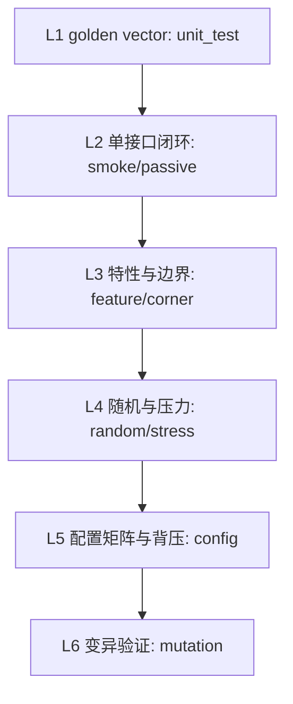

# axi4_stream VIP Validation Plan（验证方案）

> 本文件是源码设计文档，描述**如何验证这个 VIP 自己**。
> 不在此填写本次执行结果；机器 required/priority/bin 集合只维护在
> `config/verification-plan.yaml`。

> **Document ID**: `aixsilicon:vip:axi4_stream:vp`
> **VIP Name**: `axi4_stream`
> **Version**: `0.1.0`
> **Status**: `Draft`
> **Owner**: `amba-vip`
> **Requirement Baseline**: `docs/requirement.md`
> **Architecture Baseline**: `docs/architecture.md`
> **Target VLNV**: `aixsilicon:vip:axi4_stream:1.0.0`

---

# 1. Purpose

定义 axi4_stream VIP 的自验证方案：证明 90 条 REQ 定义的协议能力、观测能力、
检查能力、覆盖能力与公共 API 均已实现且工作正确，并产出可追溯证据。

---

# 2. Validation Objectives

1. **Stimulus Correctness**：driver 产生合法握手、无气泡连续流、合法注入被隔离。
2. **Observation Correctness**：monitor 独立重建 beat/packet，保留四态与 epoch。
3. **Checking Correctness**：15 条规则对真实违规报错、对合法流不误报。
4. **Coverage Correctness**：10 个覆盖组按"总线发生过"采样，配置关闭排除 bin。
5. **Qualification Readiness**：证据可被 `vip_tool.py` 抽取与判定。

---

# 3. Scope

**In scope**：本 VIP 的 UVM 类库、参数化接口、SVA、语义模型、序列库、
自验证 fixture 与构建/回归入口。

**Out of scope**：任意具体 DUT 的功能验证；AXI memory-mapped；CDC 亚稳态证明；
公共 HWIF 一致性（本仓无该契约，见 requirement §23）。

---

# 4. Strategy



四层证据：**golden vector**（纯语义，无 UVM 启动）→ **端到端 monitor 事实** →
**覆盖/统计** → **源码变异检测能力**。

---

# 5. Self Test Environment

`self_test/tb/axi4_stream_smoke_env.sv` 建立 source agent → DUT → sink agent 双向闭环：

* 两侧各有独立 monitor（REQ-SCP-004）；
* source 侧 checker + coverage + SVA；sink 侧 checker + coverage；
* scoreboard 输入侧接 source monitor `packet_ap`，输出侧接 sink monitor `packet_ap`；
* `axis_reset_sub` / `axis_error_sub` 分别把 reset/error 事件转发到对应覆盖组
  （REQ-COV-001：reset/error 独立采样）。

---

# 6. Reference Strategy

* 独立 DUT fixture（`axi4_stream_dut_fixtures.sv`）：直连/register slice、同步 FIFO、
  宽度变换、路由、故障注入。**fixture 不 import VIP package**，避免共享实现掩盖缺陷。
* golden expectation 手写在 `unit_test/axi4_stream_unit_semantic.sv` 等套件中，
  绝不调用被测的同一组合函数生成 oracle。
* 端到端比较以 monitor 接收事实为准（REQ-SCB-007）。

---

# 7. Validation Categories

L1 golden vector、L2 单接口闭环、L3 特性/边界/负向、L4 随机/压力、
L5 配置矩阵、L6 变异。与冻结计划的 regression case 一一对应。

---

# 8. Smoke

`axi4_stream_smoke_test`：单 beat 1 字节包 + 3 个 4-beat 包，走 register slice，
ALWAYS_READY。判据：`AXIS_SMOKE_PASS` 且 scoreboard `mismatched=0/unexpected=0`。

---

# 9. Basic Transactions

由 `axi4_stream_single_beat_seq` / `axi4_stream_multi_packet_seq` 覆盖单包与多包；
packet API 的 `from_bytes` 拍数与 keep 由 L1 golden vector 判定。

---

# 10. Feature

`axi4_stream_feature_test`：限定符序列（DATA/POSITION/NULL/全 NULL TLAST/仅 POSITION）、
数据模式（全 0/全 1/递增/walking-one）、4 key 逐 beat 交织、随机长度包，
背压为 RANDOM(70%, ≤5)。

---

# 11. Transaction Model

L1 `unit_transaction`：字段完整性、from_bytes 拍数/keep/拒绝不可表达长度、
0 字节包、完成状态枚举、快照独立性（REQ-TXN-007）、error event 字段。

---

# 12. Driver

`corner` 的 10000-beat ALWAYS_READY 段用于证明"无 VIP 自带气泡"（REQ-ACC-004 前半）。
driver 延迟只发生在未断言 TVALID 阶段（REQ-SRC-002）。

---

# 13. Monitor

`smoke/corner` 的 scoreboard `matched` 计数与 `open_packet_count` 用于证明
monitor 正确组包；未完成包在结束时以 warning 报告（REQ-MON-005）。

---

# 14. Initiator

Source agent 覆盖 directed/random/交织/压力场景；seed 经 `+AXIS_SEED` 与
`+ntb_random_seed` 双通道记录以便重放。

---

# 15. Target（Sink）

`axi4_stream_config_test` 逐个装载 FIXED_DELAY/PERIODIC/BURST_ACCEPT/WAIT_VALID/
BUFFER_MODEL 策略并各发 2 个包，验证 9 种背压模式的可用性。

---

# 16. Behavior

背压策略运行期可换（只影响背压语义）；语义配置更新经
`begin_semantic_update(drained=1)` 并递增 epoch（REQ-INT-003）。

---

# 17. Checker

`unit_checker` 验证规则 ID 清单、五类区分、严重度枚举、规则查询/配置 API
（`set_rule_enable`/`set_rule_severity`/`set_rule_max_report`）与命中计数。

---

# 18. Assertion

`axi4_stream_assertions` 在 smoke TB 中直接例化于 source 侧接口；
覆盖 P001/P002/P003/P004(DATA/LAST,KEEP)/P005/P006(TVALID,TREADY)/P007。

---

# 19. Mutation

`tools/mutate.py` 在 `build/<run>/mutant/<id>` 隔离副本内做 12 项源码变异；
每项编译语义包 + 注入的 `mutation_proof` 模块并运行，要求检出预期证据串。
生产源码不被修改；中间产物全部落在 build 内。

---

# 20. Error Injection

`axi4_stream_violation_injector` 提供注入计划（rule/location/cycles/seed/期望命中区间）
与 `verify_expectations`；driver 的专用破坏路径实现 stall 中撤销 VALID、
修改 TDATA/KEEP/LAST/ID、构造 TKEEP=0/TSTRB=1（缺省不启用）。

---

# 21. Ordering

默认 `AXIS_ORDER_GLOBAL`（透明 FIFO/CDC 全局保序）；多流交换/仲裁 DUT 可显式改为
`AXIS_ORDER_PER_KEY`。不默认按 key 比较。

---

# 22. Flow Control

sink driver 全部 ready 决策基于周期计数与已承诺接收周期，不读 monitor 队列长度，
避免软件环路死锁。

---

# 23. Boundary

`boundary_length` 序列覆盖 0/1/(lane-1)/lane/(lane+1)/255 字节；
corner 另含 300-beat 长包（>256 beat，REQ-PRO-008）。

---

# 24. Reset

复位由 TB 顶层统一驱动（REQ-RST-001）；driver 等待释放后才开始驱动，
只把真正在途（已断言 TVALID）的 beat 标为 `ABORTED_BY_RESET`。
完整复位阶段矩阵（多未完成包、多次复位、CDC 单侧复位）尚未成例，见 `docs/rtm.md` 缺口。

---

# 25. Timeout

`MAX_READY_WAIT`/`MAX_PACKET_IDLE` 缺省关闭；启用后分别映射 AXIS-W001（WARNING）
与 AXIS-W002（WATCHDOG）。TB 另有 10ms 仿真级 timeout 保护。

---

# 26. Configuration

L1 `unit_config` 覆盖缺省值、byte lanes（含 24/40/96/4096）、profile、
epoch、比较/顺序/复位/覆盖合同；`config` tier 覆盖背压策略组合。

---

# 27. Public API

见 `docs/user-guide.md` §12/§13；L1 直接调用 API 并断言其行为。

---

# 28. Observation API

五个 analysis port 的发布时机由 monitor 实现并记录在架构 §3；
`unit_transaction` 验证快照独立性。

---

# 29. Violation API

`error event` 字段完整性由 `unit_transaction` 与 `unit_checker` 验证；
`violation_injector.verify_expectations` 定义"预期告警缺失即失败、
额外告警即失败"。

---

# 30. Extension

扩展点：`axi4_stream_reference_model.predict()`（CUSTOM 比较）、
`axi4_stream_ready_item`（SCRIPTED 背压回调位）、应用规则 AXIS-A001/A002
（缺省关闭，由应用配置启用）。

---

# 31. RAL

**N/A**：AXI4-Stream 无寄存器语义，不提供 RAL adapter。

---

# 32. Coverage Model

10 个 covergroup：handshake / packet / qualifier / stream / sideband / reset /
config / errors / transform / cross。bin 命名与 `config/verification-plan.yaml`
的 `feature_coverage`/`cross_coverage` 一致。

---

# 33. Coverage Closure

闭合判据：四项指标 bin 命中率不低于 `config/qualification.yaml` 阈值
（缺省 100/95/90/95%），且无 mandatory OPEN hole。

---

# 34. Code Coverage

代码覆盖率不作为协议完备的判据（REQ-ACC-003）；仅作为辅助信息，
不替代功能覆盖 bin 清单。

---

# 35. Random

`axi4_stream_random_test`：40 个随机长度包（0～96 字节）+ 8 key 每包切换，
背压 RANDOM(60%, ≤8)。seed 通过命令行为固定值。

---

# 36. Stress

`axi4_stream_stress_test`：默认目标 1000000 accepted beat（可用
`+AXIS_STRESS_BEATS` 调小以适配运行时间），FULL capture + `history_limit`
限制内存；结束校验 accepted>0 并打印统计守恒行。

---

# 37. Regression Strategy

`make -C self_test regression` = `unit` + `smoke/feature/corner/random/config/passive`
+ `mutation`（stress 由 `AXIS_STRESS_BEATS` 控制规模）。

---

# 38. Regression Matrix

```text
数据位宽   : 64（主）; L1 覆盖 8/24/32/64/128/512/1024/4096 的 lanes/掩码计算
可选字段   : has_tkeep=1, has_tstrb=0, has_tlast=1, has_tready=1（主环境）
ID/DEST    : 4 / 2（多 key 交织场景）
USER       : 8（非 lane 整数倍，验证不要求整除）
构建       : FULL_UVM（active 双侧）; PASSIVE（agent 角色）
```

未覆盖的组合（无 ready/无 last/仅侧带、32↔64/24↔40 宽度变换、CDC fixture）
列为缺口（见 `docs/rtm.md` §7 gap 列）。

---

# 39. Simulator

VCS W-2024.09-SP1 + UVM 1.2（`-ntb_opts uvm-1.2`）。
`axi4_stream_assertions` 为 SVA；四态语义由 `logic` 与 X 检查使用。
第二仿真器兼容矩阵未执行。

---

# 40. Build

见 `docs/architecture.md` §33。`BUILD_DIR`/`LOG_DIR` 必须位于 `build/` 下；
filelist 在 build 内展开为绝对路径；`TMPDIR` 指向 build。

---

# 41. Metadata

运行报告使用套件 `references/report-metadata.md` 的 `vip.execution/v1` schema；
`report-context` 输出 `asset.source_fingerprint`/`config_fingerprint`/`plan.sha256`
供 AI 填写。

---

# 42. Debug

`UVM_VERBOSITY=UVM_HIGH` 时 driver 打印每拍 `handshake local_txn/stall`；
env 打印 SRC/SCOREBOARD 汇总；monitor 在结束时打印未完成包明细。

---

# 43. Statistics

accepted beats、data/position/null bytes、完成/中止包数、idle、`valid&&!ready`、
active、max_wait、throughput（DATA bytes/active cycle）、utilization（beats/active cycle）。

---

# 44. Recording

`observed_packet` 保留 beat 级历史；STREAMING 模式增量输出，FULL 模式按
`history_limit` 有界裁剪。

---

# 45. Replay

seed 双通道记录（`+ntb_random_seed` + `+AXIS_SEED`），配置与版本写入运行报告。

---

# 46. Robustness

`mutation` tier 证明检查能力对语义退化敏感；`stress` tier 证明长时间运行不丢拍。

---

# 47. Negative Configuration

L1 `unit_semantic` 覆盖非法宽度（4/12/8192）、HAS_TDATA=0 开 TKEEP、
ID/DEST/USER 越界、PER_BYTE 未整除；`config.validate`/`axis_config_check`
必须全部拒绝。

---

# 48. Naming

case ID 与 `config/verification-plan.yaml` 的 regression case 名一致
（compile/unit/smoke/feature/corner/random/stress/config/passive + 12 个 MUT-*）。

---

# 49. Case Template

每个 tier 的判据为：日志出现 `AXIS_<TIER>_PASS` 且 `UVM_ERROR=0`、`UVM_FATAL=0`。
L1 保留原判据 `UNIT_TEST_PASS` 且无 `FAILED:` 行。

---

# 50. Matrix（冻结）

机器矩阵以 `config/verification-plan.yaml` 为唯一来源，本文不复制 required/priority 表。

---

# 51. Requirement Coverage Review

`requirement_coverage` 的 90 个 bin 等于 `config/requirements.yaml` 的 REQ 集合；
逐 ID 追溯见 `docs/rtm.md` §7。

---

# 52. Exit Criteria

| # | 判据 |
|---|---|
| E1 | L1 unit 全绿且无 `FAILED:` |
| E2 | 全部 regression case 通过（`AXIS_*_PASS`，无 UVM_ERROR/FATAL） |
| E3 | 覆盖四项指标达到阈值且无 mandatory OPEN hole |
| E4 | 12 项变异全部被检出（≥95%，P0 全 PASS） |
| E5 | 六类报告 metadata 通过 + core 有效（`qualify` 计算） |
| E6 | 缺口项在 RTM 中显式记录，不冒充 PASS |

---

# 53. Evidence

证据分级与路径约束见 `docs/rtm.md` §41/§42；原始日志在
`build/<run-id>/logs`，流程报告在 `reports/<run-id>`。

---

# 54. Checklist

见 `config/verification-plan.yaml`（机器）与本文 §52（判据）。

---

# 55. Complete

验证方案完成定义：

- [x] 五类目标、L1–L6 分层、逐步策略明确。
- [x] 独立 oracle 策略明确且不与被测实现共享代码。
- [x] 每个 tier 有确定判据。
- [x] 退出判据可机器判定。
- [x] 未覆盖矩阵条目在 `docs/rtm.md` 显式记录为缺口。
- [x] 本文不声明任何 Gate PASS。
